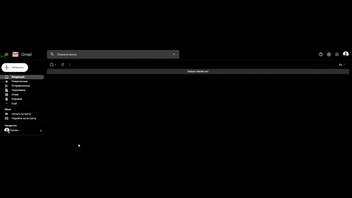

# currencyChecker
Script for tracking the dollar exchange rate and sending an email in case of a drastic change in the exchange rate.

***You need to change RECIPIENT_MAIL, SENDER_MAIL, SENDER_PASSWORD variables in the config.py file.***